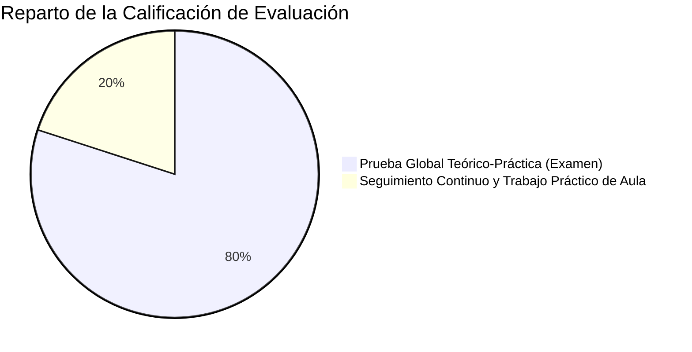

# 🚀 Presentación Inicial del Módulo Profesional
## Bienvenida, Guía de Trabajo, Metodología y Sistema de Evaluación

---

## 🧭 Slide 1: Portada Institucional

- **Centro Educativo**: IES [Nombre del Centro] (Avilés, Principado de Asturias)
- **Familia Profesional**: Informática y Comunicaciones
- **Ciclo Formativo**: [Nombre del Ciclo: DAM / DAW / SMR] — [1º / 2º] Curso
- **Módulo**: **[Nombre del Módulo]** (Código Oficial: [XXXX])
- **Profesor**: Sergio ([correo@educastur.es / contacto])
- **Curso Académico**: 2026 - 2027

> *"Aprender a través de la práctica activa, herramientas reales del mercado y rigor profesional."*

---

## 💡 Slide 2: ¿De qué trata este módulo? (Visión General)

### 🎯 Propósito del Módulo
- [Explicar en 2-3 líneas el objetivo central del módulo en el perfil profesional del ciclo].
- ¿Por qué es una pieza clave en el mercado laboral actual?
- ¿Qué problemas de la vida real resuelve el perfil técnico que domina esta materia?

### 🧩 Conexión con otros módulos del ciclo
- **Prerrequisitos / Base**: [Módulos previos o simultáneos, ej. Programación, BBDD, Sistemas Informáticos].
- **Salida / Proyección**: [Hacia dónde conduce: Proyecto Intermodular, FCT / Formación en Empresa, Empleo].

---

## 🗺️ Slide 3: Mapa de Contenidos y Unidades de Trabajo (UTs)

| Bloque / Trimestre | Unidad de Trabajo (UT) | Horas Aprox. | Tecnologías / Herramientas Clave |
| :---: | :--- | :---: | :--- |
| **1º Trimestre** | **UT1**: [Título de la Unidad 1] | [XX] h | [Ej. Java, Git, Maven...] |
| **1º Trimestre** | **UT2**: [Título de la Unidad 2] | [XX] h | [Ej. Oracle Database, JDBC, DAO...] |
| **1º / 2º Trim.** | **UT3**: [Título de la Unidad 3] | [XX] h | [Ej. Spring Boot, JPA, Hibernate...] |
| **2º Trimestre** | **UT4**: [Título de la Unidad 4] | [XX] h | [Ej. BDOO, db4o, XML...] |
| **2º Trimestre** | **UT5**: [Título de la Unidad 5] | [XX] h | [Ej. MongoDB, NoSQL, APIs...] |
| **2º Trimestre** | **UT6**: [Título de la Unidad 6 / Síntesis] | [XX] h | [Ej. Componentes, Despliegue...] |

> **Carga Lectiva Total**: [XXX] horas anuales ([X] horas semanales).

---

## ⚙️ Slide 4: ¿Cómo vamos a trabajar? (Metodología Pedagógica)

### 🔄 La Secuencia de Aprendizaje en el Aula
1. **Teoría Breve y Aplicada (15 - 20 min máximo)**:
   - Exposición ágil del concepto técnico o arquitectónico.
   - Proyección de ejemplos de código reales y ejecutables.
2. **Ejercicios Inmediatos por Concepto**:
   - Manos al teclado al terminar la explicación.
   - Resolución guiada y resolución de dudas sobre la marcha.
3. **Práctica Integradora de UT (Formativa / Consolidación)**:
   - Al finalizar cada unidad, se desarrolla una práctica integradora que aglutina todos los conceptos vistos.
   - **Objetivo**: Afianzar competencias y comprobar el nivel técnico antes de la evaluación.

---

## 📅 Slide 5: Fases del Curso (1ª y 2ª Evaluación)

### 🔹 Fase 1: Adquisición Técnica Intensiva (1ª Evaluación y primeros compases de la 2ª)
- Dominio paso a paso de cada tecnología y estándar del módulo.
- Trabajo intensivo en aula / taller con feedback constante.
- Consolidación individual y por parejas de cada bloque temático.

### 🔹 Fase 2: Integración en Proyecto Intermodular (2ª Evaluación)
- Aplicación de **todos los conceptos aprendidos** dentro de un proyecto transversal realista.
- Simulación de entorno laboral: trabajo en equipo, control de versiones (Git/GitHub), arquitectura en capas y entregas por sprints.

---

## 📊 Slide 6: ¿Cómo se evalúa? (Instrumentos y Calificación)

La evaluación es **criterial, continua y formativa**:

### 1. Prueba Global Teórico-Práctica / Examen de Evaluación (80%)
- Se realiza al concluir los bloques temáticos de la evaluación.
- **Estructura**:
  - **Parte Conceptual (Tipo Test / Preguntas Cortas)**: Valida la comprensión de fundamentos y vocabulario técnico.
  - **Parte Práctica (Supuesto de Programación / Configuración)**: Desarrollo de código o resolución de casos en entorno controlado.

### 2. Seguimiento Continuo y Trabajo de Aula / Plataforma (20%)
- Realización y entrega regular de los ejercicios propuestos en clase.
- Calidad técnica del código, buenas prácticas y pulcritud.
- Participación activa, puntualidad y actitud profesional.

> ℹ️ *Nota*: Las **Prácticas de Unidad** son de carácter formativo (afianzamiento sin nota numérica fija que penalice el aprendizaje); preparan directamente para superar con éxito la prueba global.

---

## ⚖️ Slide 7: Condiciones de Superación y Recuperaciones

### 🎯 Criterios de Aprobado
- **Calificación mínima para superar la evaluación**: **5.0 / 10**.
- **Evaluación Criterial**: Es necesario alcanzar una media de **5.0** en los Resultados de Aprendizaje (RAs) evaluados, sin tener ningún RA con calificación inferior a **4.0**.

### 🔁 Sistema de Recuperación
- Quienes no alcancen el 5.0 o tengan RAs por debajo de 4.0 dispondrán de una **prueba de recuperación específica** de los criterios o unidades no superados.
- Convocatoria extraordinaria a final de curso para aquellos alumnos que mantengan materias pendientes.

---

## 🛠️ Slide 8: Entorno de Trabajo y Herramientas Técnicas

Durante el curso trabajaremos con estándares actuales de la industria del software:

- 💻 **Entornos de Desarrollo (IDEs)**: IntelliJ IDEA / VS Code / Eclipse.
- ☕ **Plataforma / Lenguaje**: Java JDK (versiones LTS 17 / 21) [o lenguaje correspondiente].
- 🗄️ **Sistemas de Persistencia**: Oracle Database XE, Docker, MongoDB [o según módulo].
- 🐙 **Control de Versiones**: Git & GitHub (flujo de trabajo con ramas y commits profesionales).
- 📦 **Gestores de Construcción**: Apache Maven / Gradle.
- 📚 **Materiales y Apuntes**: Formato interactivo HTML y PDF estandarizado entregado en la plataforma oficial.

---

## 🤝 Slide 9: Reglas de Convivencia y Compromiso Profesional

Para garantizar un clima de trabajo productivo y similar al de una empresa tecnológica:

1. **Puntualidad y Asistencia**: La asistencia continua es clave para no perder el hilo práctico. Las faltas injustificadas se gestionan según la normativa del centro.
2. **Uso Profesional de los Equipos de Aula**:
   - Los ordenadores del centro son herramientas exclusivas de trabajo formativo.
   - Respeto a las configuraciones, periféricos y limpieza del espacio.
3. **Plazos y Honestidad Académica**:
   - Entrega puntual de ejercicios en la plataforma.
   - El uso de herramientas de IA asistida (GitHub Copilot, ChatGPT, etc.) está **permitido y fomentado como copiloto de aprendizaje**, pero el alumno **debe ser capaz de explicar, justificar y modificar cualquier línea de código que presente**.

---

## 💬 Slide 10: Canales de Comunicación y Espacios de Trabajo

- 🏫 **En el Aula**: Consultas directas durante el tiempo de trabajo práctico y docencia.
- 🌐 **Aula virtual en el Moodle de Educastur (acceso con cuenta Educastur)**:
  - Documentos, temario, entrega de trabajos… todo en el aula virtual.
  - **Obligatorio el acceso y la comprobación periódica**.
- 📧 **Comunicaciones exclusivamente por canales oficiales**: Correo institucional de Educastur y Microsoft Teams.
- 🕒 **Tutorías y Horarios**: [Horario oficial y espacios de atención individualizada].

---

## 🏁 Slide 11: ¡Comenzamos!

> *"El éxito en este módulo no depende de memorizar sintaxis, sino de practicar cada día, experimentar sin miedo a equivocarse y aprender a depurar los errores."*

### 👉 Próximo paso:
- Configuración del entorno de desarrollo en el aula.
- Presentación de la **Unidad 1: [Título de la Primera Unidad]**.

**¿Alguna pregunta antes de arrancar?** 🙋‍♂️
