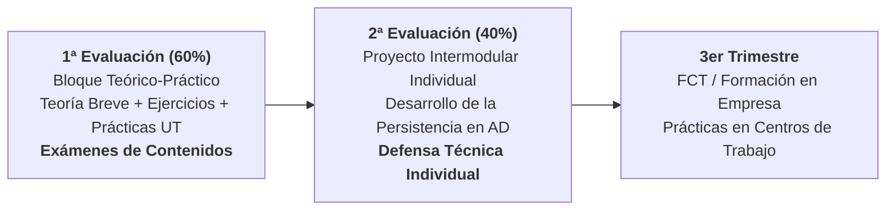

# 🚀 Presentación Inicial: Acceso a Datos (DAM 2º)
## Guía Docente del Módulo, Metodología de Trabajo y Sistema de Evaluación

---

## 🧭 Slide 1: Portada Institucional

- **Centro Educativo**: CIFP Avilés (Centro Integrado de Formación Profesional)
- **Familia Profesional**: Informática y Comunicaciones
- **Ciclo Formativo**: Grado Superior en Desarrollo de Aplicaciones Multiplataforma (DAM) — 2º Curso
- **Módulo Profesional**: **Acceso a Datos (AD)** · Código Oficial: **0486**
- **Profesor**: Sergio Capdevila Díez
- **Curso Académico**: 2026 - 2027
- **Duración**: 140 horas curriculares (4 horas semanales presenciales vespertinas · Aula C210) · 9 ECTS

> *"Cualquier aplicación real vive o muere según su persistencia: aprenderemos a conectar, gestionar y optimizar datos con tecnologías profesionales de mercado."*

---

## 💡 Slide 2: ¿De qué trata el módulo de Acceso a Datos?

### 🎯 Propósito Central del Módulo
Aprender a almacenar, recuperar, procesar y sincronizar información de forma eficiente, desacoplada y segura entre aplicaciones Java y diferentes sistemas de almacenamiento (desde el sistema de ficheros físico local hasta bases de datos empresariales relacionales y distribuidas).

### 🧩 ¿Cómo se conecta con el perfil DAM?
- **Punto de partida**: Vienes de programar en Java en 1º (POO, estructuras y sintaxis básica).
- **El salto cualitativo en AD**: Dejamos de trabajar con datos volátiles en memoria RAM para construir arquitecturas de persistencia robustas que sobreviven al cierre de la aplicación.
- **Proyección**: Conduce de forma directa al desarrollo backend, microservicios, integración con apps móviles y al **Proyecto Intermodular**.

---

## 🗺️ Slide 3: Mapa de Contenidos y Unidades de Trabajo (UTs)

El curso lectivo de 2º DAM se concentra en **dos evaluaciones** antes de la FCT (3er trimestre en empresa):

| Evaluación | Unidad de Trabajo (UT) | Grado de Profundidad | Tecnologías y Paradigmas Clave |
| :---: | :--- | :---: | :--- |
| **1ª Eval** | **UT1: Manejo de Ficheros** | **Nuclear / Intensivo** | Texto plano, Java NIO.2 (`Files`/`Path`), flujos binarios, serialización y ficheros XML. |
| **1ª Eval** | **UT2: Manejo de Conectores** | **Nuclear / Intensivo** | Conexión a **Oracle Database**, Driver JDBC Thin, pools con HikariCP, transacciones ACID y DAO/DTO. |
| **1ª Eval** | **UT3: Mapeo Objeto-Relacional (ORM)** | **Nuclear / Intensivo** | **Spring Boot 3**, **Spring Data JPA**, Hibernate y Oracle. Mapeo de entidades y consultas JPQL. |
| **1ª Eval** | **UT5: BBDD No Relacionales (NoSQL)** | **Nuclear / Intensivo** | **MongoDB**: Esquemas dinámicos BSON, consultas y agregaciones, y Spring Data MongoDB. |
| **1ª Eval** | **UT4: BBDD Objeto-Relacionales / XML** | *Superficial / Básico* | Conceptos fundamentales de persistencia de objetos nativos y bases documentales XML. |
| **1ª Eval** | **UT6: Componentes de Acceso a Datos** | *Superficial / Básico* | Conceptos esenciales de componentes reutilizables y especificación de empaquetado. |
| **2ª Eval** | **Proyecto Intermodular (AD)** | **Proyecto Individual** | **Desarrollo de la capa de persistencia completa** del proyecto intermodular individual. |
| **3er Trim** | **FCT / DUAL en Empresa** | *Formación en Centros* | Prácticas profesionales en empresas del sector (a partir de marzo). Sin docencia de aula. |

---

## ⚙️ Slide 4: ¿Cómo vamos a trabajar en el día a día?

### 🔄 La Dinámica de Clase ("Aprender Haciendo")
1. **Teoría Breve y Enfocada a la Práctica (15 - 20 minutos)**:
   - Exposición conceptual muy ágil del problema arquitectónico o del conector.
   - Demostración de código ejecutable en directo (*live coding*).
2. **Ejercicios Prácticos Inmediatos**:
   - Programación guiada individual en el aula de ordenadores con retroalimentación en directo.
   - Asimilación inmediata de la sintaxis y depuración de excepciones habituales.
3. **Práctica Integradora por UT (Formativa / No Evaluable Numéricamente)**:
   - Al finalizar cada unidad se desarrolla una práctica de consolidación.
   - **No computa nota numérica de castigo**: su objetivo es afianzar conceptos, medir tu ritmo real y resolver dificultades antes de los exámenes.

---

## 📅 Slide 5: Las Dos Evaluaciones del Curso

### 🔹 1ª Evaluación: Adquisición Técnica Intensiva (60% de la Nota)
- Dominar los 4 pilares: **Ficheros**, **JDBC relacional (Oracle)**, **ORM (Spring Boot / JPA)** y **NoSQL (MongoDB)**, con pinceladas básicas de UT4 y UT6.
- Evaluación mediante **uno o varios exámenes teórico-prácticos** para verificar la superación de contenidos.

### 🔹 2ª Evaluación: Proyecto Intermodular Individual (40% de la Nota)
- Desarrollo **estrictamente individual** de un proyecto de software transversal de ciclo.
- Durante las horas de Acceso a Datos, el alumnado se centrará en **diseñar, programar y defender la arquitectura de persistencia y datos del proyecto**, aplicando todo lo aprendido.

---

## 📊 Slide 6: Sistema de Calificación y Ponderación

$$\text{Nota Final} = 0.60 \cdot \text{Nota 1ª Evaluación} + 0.40 \cdot \text{Nota 2ª Evaluación}$$

| Bloque / Evaluación | Ponderación | Instrumentos y Características |
| :--- | :---: | :--- |
| **1ª Evaluación** *(Contenidos Teórico-Prácticos)* | **60%** | **Uno o varios exámenes teórico-prácticos** en entorno controlado: • Comprensión conceptual y diseño de modelos. • Programación directa en Java (ficheros, JDBC, JPA, MongoDB). *(Las prácticas por UT son formativas de afianzamiento).* |
| **2ª Evaluación** *(Proyecto Intermodular Individual)* | **40%** | **Capa de Persistencia y Acceso a Datos del Proyecto**: • Arquitectura técnica de datos y repositorios (50%). • Funcionalidad CRUD, transacciones y persistencia políglota (30%). • Repositorio Git, documentación técnica y **defensa individual** (20%). |

---

## ⚖️ Slide 7: Requisito Indispensable y Recuperaciones

> [!IMPORTANT]
> ### 🎯 Condición Indispensable de Aprobado: Superar Ambas Partes con > 5.0
> Para poder hacer la media ponderada y aprobar el módulo, es **estrictamente obligatorio obtener una calificación igual o superior a 5.0 puntos en AMBAS evaluaciones de forma independiente**:
> $$\text{Nota 1ª Evaluación} \ge 5.0 \quad \text{y} \quad \text{Nota 2ª Evaluación} \ge 5.0$$
> Si alguna de las dos partes no alcanza el 5.0, el módulo quedará suspenso y deberá recuperarse la parte o partes suspensas.

### 🔁 Sistema de Recuperación
- **Recuperación de la 1ª Evaluación**: Examen global teórico-práctico de recuperación en aula de informática.
- **Recuperación de la 2ª Evaluación**: Subsanación de no conformidades técnicas en el repositorio del proyecto y re-defensa individual.
- **Convocatoria Extraordinaria**: Se evalúa exclusivamente la parte o partes pendientes (< 5.0), guardándose la calificación de las partes aprobadas en ordinaria.

---

## 🛠️ Slide 8: Tecnologías y Ecosistema de Trabajo

Durante el curso utilizaremos herramientas profesionales estándar del sector:

- ☕ **Lenguaje**: Java SE (LTS 17 / 21).
- 💻 **IDE Recomendado**: IntelliJ IDEA Community / Eclipse IDE / VS Code.
- 🗄️ **Motores de Bases de Datos**:
  - **Oracle Database XE** (BBDD relacional empresarial).
  - **MongoDB Community Server** (BBDD NoSQL documental).
- 🌱 **Frameworks Backend**: Spring Boot 3, Spring Data JPA, Hibernate.
- 📦 **Gestor de Dependencias**: Apache Maven.
- 🐙 **Control de Versiones**: Git y GitHub.
- 📑 **Apuntes y Materiales**: Documentos maquetados en HTML y PDF A4 disponibles en la plataforma.

---

## 🤝 Slide 9: Reglas de Aula y Compromiso Profesional

1. **Puntualidad y Asistencia**:
   - En presencial: llegar puntual a las sesiones de taller.
   - En virtual: regularidad semanal en la plataforma y entrega puntual de tareas quincenales.
2. **Cuidado del Aula y Equipamiento**:
   - Máximo respeto al hardware y a las configuraciones de red del centro educativo.
3. **Uso de Inteligencia Artificial Asistida (GitHub Copilot, ChatGPT, etc.)**:
   - **Está permitida y recomendada** como acelerador y copiloto de aprendizaje.
   - **Condición innegociable**: Debes comprender y ser capaz de defender, modificar y justificar cualquier línea de código que presentes ante el profesor. El examen presencial sin conexión medirá tu dominio real.

---

## 💬 Slide 10: Canales de Comunicación y Espacios de Trabajo

- 🏫 **Clases Presenciales**: Aula **C210** (Lunes y Miércoles, turno de tarde).
- 💻 **Atención / Tutoría Virtual**: Aula **C212** (Lunes 15:45 - 16:40) y Microsoft Teams.
- 🌐 **Aula virtual en el Moodle de Educastur (acceso con cuenta Educastur)**:
  - Documentos, temario, entrega de trabajos… todo en el aula virtual.
  - **Obligatorio el acceso y la comprobación periódica**.
- 📧 **Comunicaciones exclusivamente por canales oficiales**:
  - Correo institucional de Educastur y Microsoft Teams.
- 🕒 **Horario Oficial y Guardias**: [[Horario-Docente-Sergio-2026-2027|Consulta el Horario Docente Completo]].

---

## 🏁 Slide 11: ¡Arrancamos el Curso!

> *"No te preocupes si al principio una sentencia SQL falla o una conexión de base de datos no responde: depurar errores es el 80% del trabajo real de un desarrollador de software."*

### 👉 Próxima Sesión:
- Comprobación de la instalación de Java JDK y Maven en los puestos del aula.
- Inicio formal de la **UT1: Manejo de Ficheros (Texto Plano y Java NIO.2)**.

**¿Dudas o preguntas iniciales?** 🙋‍♂️
