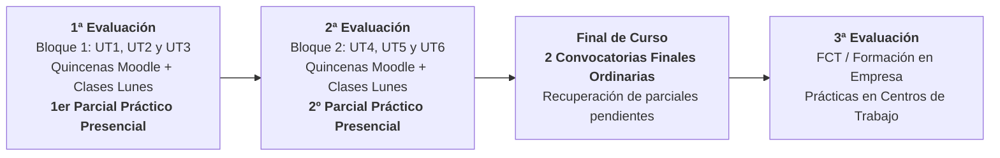

# 💻 Presentación Inicial: Acceso a Datos — A Distancia (DAM 2º)
## Guía Docente, Plataforma Virtual, Clases Telemáticas de los Lunes, Evaluaciones y Calificación

---

## 🧭 Slide 1: Portada Institucional

- **Centro Educativo**: CIFP Avilés (Centro Integrado de Formación Profesional)
- **Familia Profesional**: Informática y Comunicaciones
- **Ciclo Formativo**: Grado Superior en Desarrollo de Aplicaciones Multiplataforma (DAM) — 2º Curso
- **Módulo Profesional**: **Acceso a Datos (AD)** · Código: **0486** (9 ECTS)
- **Modalidad**: **A Distancia / Virtual**
- **Docencia Telemática**: **2 horas de clase virtual síncrona los lunes** + Moodle Educastur
- **Profesor**: Sergio Capdevila Díez (Jefe de Departamento de Informática)
- **Curso Académico**: 2026 - 2027

> *"La formación a distancia te da la flexibilidad que necesitas, pero requiere constancia semanal: el acceso a datos es el corazón de cualquier backend profesional."*

---

## 💡 Slide 2: ¿De qué trata el módulo en Modalidad Virtual?

### 🎯 Propósito Central del Módulo
Aprender a almacenar, recuperar, procesar y sincronizar información de forma eficiente, desacoplada y transaccional entre aplicaciones Java y diferentes sistemas de almacenamiento (desde el sistema de ficheros local hasta bases de datos empresariales relacionales y distribuidas NoSQL).

### 🧩 Del Código en Memoria a la Persistencia Profesional
- **Punto de partida**: Vienes de programar en Java en 1º de DAM en memoria RAM.
- **El salto en AD**: Diseñar capas de persistencia que sobreviven al cierre de la aplicación, garantizando concurrencia, transacciones ACID y persistencia políglota para aplicaciones backend profesionales.

---

## 📅 Slide 3: Estructura del Curso: 2 Evaluaciones Lectivas + FCT

Al ser un segundo curso de Formación Profesional, el calendario académico a distancia concentra la docencia en **dos evaluaciones**, ya que durante el **tercer trimestre** (a partir de marzo) el alumnado se incorpora a las empresas para cursar la **FCT (Formación en Centros de Trabajo / Prácticas)**:

- **Sin Proyecto Intermodular en AD**: Se cursa en su módulo independiente, no dentro de Acceso a Datos.
- **1ª Evaluación (Septiembre - Diciembre)**: Bloque 1 de contenidos $\longrightarrow$ **1er Parcial Práctico**.
- **2ª Evaluación (Enero - Marzo)**: Bloque 2 de contenidos $\longrightarrow$ **2º Parcial Práctico**.
- **Final de Curso**: **1ª y 2ª Convocatoria Final Ordinaria** para recuperar partes o parciales pendientes.
- **3ª Evaluación (Marzo - Junio)**: FCT en centros de trabajo (sin carga lectiva en plataforma).

---

## 🗺️ Slide 4: Mapa de Contenidos y Distribución de Unidades

| Período / Quincenas | Unidad de Trabajo (UT) | Competencias y Tecnologías Clave | RAs | Hito y Fecha Oficial de Evaluación |
| :---: | :--- | :--- | :---: | :--- |
| **Q1 - Q2** *(Sep - Oct)* | **UT1: Manejo de Ficheros** | Streams I/O, `Files`/`Path` (NIO.2), RAF y XML | **RA1** (15%) | Formativa Moodle |
| **Q3 - Q4** *(Oct - Nov)* | **UT2: Conectores JDBC & Oracle** | Driver JDBC, pools HikariCP, transacciones ACID y DAO/DTO | **RA2** (20%) | Formativa Moodle |
| **Q5 - Q6** *(Nov - Dic)* | **UT3: Mapeo Objeto-Relacional (ORM)** | Spring Boot 3, Hibernate, Jakarta Persistence y JPQL | **RA3** (25%) | Formativa Moodle |
| **16/12/2026** *(1ª Eval)* | **1er Examen Parcial Práctico** | Prueba práctica presencial en ordenador en el CIFP Avilés | **RA1, RA2, RA3** | **📝 Parcial 1 (Liberatorio)** **16 de diciembre de 2026** |
| **Q7 - Q8** *(Ene - Feb)* | **UT4: Persistencia OO & XML** | Bases de datos orientadas a objetos (db4o) y XML nativo | **RA4** (10%) | Formativa Moodle |
| **Q9 - Q10** *(Feb)* | **UT5: Bases de Datos NoSQL** | MongoDB, BSON, filtros, agregaciones y Spring Data Mongo | **RA5** (20%) | Formativa Moodle |
| **Q11** *(Feb)* | **UT6: Componentes de Acceso a Datos** | Especificación JavaBeans, eventos y empaquetado en JAR | **RA6** (10%) | Formativa Moodle |
| **25/02/2027** *(2ª Eval)* | **2º Examen Parcial Práctico** | Prueba práctica presencial en ordenador en el CIFP Avilés | **RA4, RA5, RA6** | **📝 Parcial 2 (Liberatorio)** **25 de febrero de 2027** |
| **27/05/2027** *(1ª Ord)* | **1ª Convocatoria Final Ordinaria** | Examen práctico presencial de parciales/RAs pendientes | **RA pendientes** | **🔄 1ª Final Ordinaria** **27 de mayo de 2027** |
| **16/06/2027** *(2ª Ord)* | **2ª Convocatoria Final Ordinaria** | Segunda oportunidad ordinaria de examen de pendientes | **RA pendientes** | **🔄 2ª Final Ordinaria** **16 de junio de 2027** |

---

## ⚙️ Slide 5: Dinámica de Trabajo a Distancia y Clases de los Lunes

### 🔄 Los 3 Pilares del Aprendizaje a Distancia
1. **Materiales Curriculares en Campus Virtual Moodle**:
   - Apuntes maquetados (HTML/PDF), ejemplos de código listos para importar en Eclipse (o tu IDE con Maven) y guías paso a paso disponibles 24/7.
2. **Clase Virtual Síncrona Semanal (2 Horas los Lunes)**:
   - Conexión en directo vía Microsoft Teams.
   - Demostraciones prácticas en vivo (*live coding*), explicación de conceptos esenciales y **resolución prioritaria de dudas** sobre los materiales subidos.
   - *(Importante: Las clases NO quedan grabadas).*
3. **Prácticas Integradoras por UT (Formativa / No Numéricas)**:
   - Tareas para comprobar tu progreso y consolidar conocimientos.
   - **No computan numéricamente con nota de penalización**: su objetivo es afianzar conceptos antes de los exámenes presenciales.
4. **💬 Canal Oficial de Dudas**:
   - Las dudas se resuelven a través de **Microsoft Teams** y en las **sesiones síncronas de los lunes** (no a través de foros de Moodle).

---

## 📝 Slide 6: Evaluación 100% Práctica en Ordenador (Teoría Aplicada)

- **Calificación Exclusivamente por Exámenes Prácticos**:
  - Toda la evaluación se realiza **mediante exámenes prácticos presenciales en ordenador** en el CIFP Avilés.
- **Teoría Aplicada y Resolución Técnica**:
  - No hay exámenes teóricos memorísticos: el conocimiento de los conceptos se evalúa **mediante el desarrollo directo de código y resolución de problemas de persistencia** en Java (manejo de ficheros NIO.2, JDBC transaccional con Oracle, repositorios Spring Data JPA y consultas MongoDB).
- **Cobertura Curricular Completa**:
  - Los ejercicios de examen evalúan rigurosamente **todos los Resultados de Aprendizaje (RA1 a RA6)**.
- **Entorno Controlado**:
  - Pruebas desarrolladas en los equipos de aula del centro, en entorno cerrado y sin acceso a Internet ni herramientas de IA generativa.

---

## 🎯 Slide 7: Sistema de 2 Exámenes Parciales (Liberatorios)

- **1er Examen Parcial Práctico (1ª Evaluación · 16 de Diciembre de 2026)**:
  - Evalúa los ejercicios prácticos de **RA1 (15%)**, **RA2 (20%)** y **RA3 (25%)**.
  - Representa el **60% del peso curricular total**.
  - **Fecha Oficial**: **16/12/2026**.
- **2º Examen Parcial Práctico (2ª Evaluación · 25 de Febrero de 2027)**:
  - Evalúa los ejercicios prácticos de **RA4 (10%)**, **RA5 (20%)** y **RA6 (10%)**.
  - Representa el **40% del peso curricular total**.
  - **Fecha Oficial**: **25/02/2027**.

> [!IMPORTANT]
> ### 🏆 Superación Directa del Módulo por Parciales
> Si obtienes una calificación **igual o superior a 5.0 en ambos parciales**:
> $$\text{Nota Parcial 1} \ge 5.0 \quad \text{y} \quad \text{Nota Parcial 2} \ge 5.0$$
> **¡Apruebas el módulo directamente!** Tu nota final será la media ponderada de los RAs:
> $$\text{Calificación Final} = 0.60 \cdot \text{Parcial 1} + 0.40 \cdot \text{Parcial 2}$$

---

## ⚖️ Slide 8: Dos Convocatorias Finales Ordinarias a Final de Curso

### 🔁 ¿Qué ocurre si no supero un parcial o no puedo presentarme?
Para quienes tengan algún parcial pendiente (&lt; 5.0) o no hayan asistido, existen **dos convocatorias finales ordinarias** fijadas en el calendario oficial:

1. **1ª Convocatoria Final Ordinaria · 27 de Mayo de 2027 (27/05/2027)**:
   - Examen práctico presencial de recuperación de la parte o parcial no superado.
2. **2ª Convocatoria Final Ordinaria · 16 de Junio de 2027 (16/06/2027)**:
   - Segunda oportunidad oficial previa a la convocatoria extraordinaria.
3. **Liberación de Materia Aprobada**:
   - **Solo te examinas de lo que te quede pendiente** (Parcial 1, Parcial 2 o ambos si suspendiste los dos). Lo aprobado en parciales con &ge; 5.0 queda guardado.
4. **Requisito de Aprobado**:
   - Obtener &ge; 5.0 en cada bloque evaluado para formalizar la media final del módulo.

---

## 🛠️ Slide 9: Ecosistema Tecnológico a Distancia

- 💻 **Entorno de Trabajo (IDE)**: **Eclipse IDE** (entorno de referencia para explicaciones síncronas y guías). *Libertad para utilizar otros IDEs (IntelliJ IDEA, VS Code) siempre que los proyectos compilen con Maven.*
- ☕ **Java SE 21 LTS**: Lenguaje base del curso.
- 🗄️ **Oracle Database XE**: Instalación local o contenedor Docker.
- 🍃 **MongoDB Community Server**: Base de datos NoSQL documental.
- 🌱 **Spring Boot 3 & JPA**: Framework backend corporativo.
- 📦 **Apache Maven**: Gestión automatizada de dependencias.
- 🐙 **Git & GitHub**: Control de versiones y alojamiento de proyectos técnicos.

---

## 🤝 Slide 10: Política de Uso de Inteligencia Artificial (IA) y Disciplina

1. **Constancia y Gestión del Tiempo**:
   - Asiste a las 2 horas síncronas de los lunes y trabaja el material quincenal en Moodle.
2. **Política sobre Inteligencia Artificial (IA)**:
   - 📖 **Estudio Autónomo y Resolución de Dudas**: Se permite como tutor complementario para solventar dudas conceptuales y analizar errores de ejecución.
   - ⚠️ **Tareas y Prácticas Formativas de Moodle**: **No se recomienda su utilización**. Resolver el código por ti mismo es la única forma de adquirir la agilidad necesaria para los exámenes en ordenador.
   - 🚫 **Exámenes Presenciales Oficiales (Parciales y Finales)**: **Terminantemente prohibida**. Las pruebas se realizan en los equipos del centro sin conexión externa ni herramientas de IA.

---

## 🌐 Slide 11: Espacios Virtuales y Canales Oficiales

- 💻 **Clases Virtuales Síncronas**: **Lunes (2 horas, 17:35 - 19:25)** vía Microsoft Teams (contenidos y resolución de dudas en vivo).
- 🎓 **Campus Virtual Moodle Educastur**: Aula virtual oficial del módulo (descarga de apuntes, enunciados y entrega de tareas formativas, avisos y calificaciones). *(Sin foros de dudas)*.
- 💬 **Resolución de Dudas**: Se resuelven a través de **Microsoft Teams** y en las **sesiones síncronas** de los lunes (no a través de foros de Moodle).
- 🤝 **Tutorías Individuales**: Se agendarán a través de **Microsoft Teams previa solicitud de cita por correo electrónico**.
- 🏫 **Punto Presencial de Referencia**: Sede física del CIFP Avilés (para la realización de exámenes oficiales en ordenador).
- 📧 **Contacto y Solicitud de Citas**: Correo corporativo Educastur del docente.

---

## 🏁 Slide 12: ¡Comenzamos! Próximos Pasos

- Accede al aula virtual de Acceso a Datos en Moodle Educastur.
- Comprueba tu acceso a Microsoft Teams para la **primera clase virtual del próximo lunes**.
- Instala Java JDK 21 y tu entorno de desarrollo favorito (Eclipse IDE de referencia).
- ¡Arrancamos con la **UT1: Manejo de Ficheros**!

**¿Dudas o preguntas iniciales? ¡Nos vemos en Teams y el lunes en directo!** 🙋‍♂️
