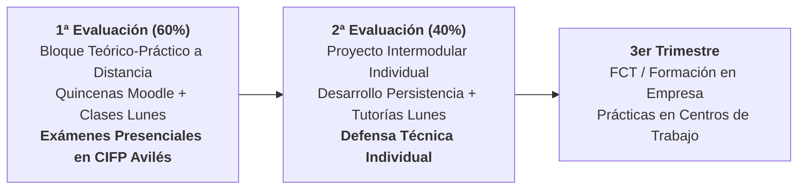

# 💻 Presentación Inicial: Acceso a Datos — A Distancia (DAM 2º)
## Guía Docente, Plataforma Virtual, Clases Telemáticas de los Lunes, Evaluaciones y Calificación

---

## 🧭 Slide 1: Portada Institucional

- **Centro Educativo**: CIFP Avilés (Centro Integrado de Formación Profesional)
- **Familia Profesional**: Informática y Comunicaciones
- **Ciclo Formativo**: Grado Superior en Desarrollo de Aplicaciones Multiplataforma (DAM) — 2º Curso
- **Módulo Profesional**: **Acceso a Datos (AD)** · Código: **0486** (9 ECTS)
- **Modalidad**: **A Distancia / Virtual**
- **Docencia Telemática**: **2 horas de clase virtual síncrona los lunes** + Moodle Educastur
- **Profesor**: Sergio Capdevila Díez (Jefe de Departamento de Informática)
- **Curso Académico**: 2026 - 2027

> *"La formación a distancia te da la flexibilidad que necesitas, pero requiere constancia semanal: el acceso a datos es el corazón de cualquier backend profesional."*

---

## 💡 Slide 2: ¿De qué trata el módulo en Modalidad Virtual?

### 🎯 Propósito Central del Módulo
Aprender a almacenar, recuperar, procesar y sincronizar información de forma eficiente, desacoplada y transaccional entre aplicaciones Java y diferentes sistemas de almacenamiento (desde el sistema de ficheros local hasta bases de datos empresariales relacionales y distribuidas NoSQL).

### 🧩 Del Código en Memoria a la Persistencia Profesional
- **Punto de partida**: Vienes de programar en Java en 1º de DAM en memoria RAM.
- **El salto en AD**: Diseñar capas de persistencia que sobreviven al cierre de la aplicación, garantizando concurrencia, transacciones ACID y persistencia políglota para el backend y el **Proyecto Intermodular**.

---

## 📅 Slide 3: Estructura del Curso: 2 Evaluaciones Lectivas

Al ser un segundo curso de Formación Profesional, el calendario académico a distancia se concentra en **dos evaluaciones**, ya que durante el **tercer trimestre** (a partir de marzo) el alumnado se incorpora a las empresas para cursar la **FCT (Formación en Centros de Trabajo)**:

- **1ª Evaluación (Septiembre - Diciembre)**: Bloque Teórico-Práctico intensivo (**60% de la nota final**).
- **2ª Evaluación (Enero - Marzo)**: Proyecto Intermodular Individual (**40% de la nota final**).
- **3er Trimestre (Marzo - Junio)**: FCT en empresa (sin carga lectiva en plataforma).

---

## 🗺️ Slide 4: Mapa de Contenidos por Quincenas (UTs Nucleares vs. Superficiales)

| Quincenas | Unidad de Trabajo (UT) | Tratamiento Curricular | Competencias y Tecnologías | RAs |
| :---: | :--- | :---: | :--- | :---: |
| **Q1 - Q2** | **UT1: Manejo de Ficheros** | **Nuclear / Intensivo** | Streams I/O, `Files`/`Path`, Serialización y XML | RA1 |
| **Q3 - Q4** | **UT2: Conectores JDBC & Oracle** | **Nuclear / Intensivo** | Driver JDBC, HikariCP, transacciones ACID y DAO/DTO | RA2 |
| **Q5 - Q6** | **UT3: Mapeo Objeto-Relacional (ORM)** | **Nuclear / Intensivo** | Spring Boot 3, Spring Data JPA, Hibernate y JPQL | RA3 |
| **Q7** | **UT5: Bases de Datos NoSQL** | **Nuclear / Intensivo** | MongoDB, BSON, consultas y Spring Data Mongo | RA5 |
| **Q7** | **UT4 & UT6: Persistencia OO & Componentes** | *Superficial / Básico* | db4o y conceptos de reutilización básica | RA4, RA6 |
| **Dic.** | **Exámenes Presenciales Oficiales** | **Sumativo 1ª Eval** | Pruebas presenciales obligatorias en el CIFP Avilés | RA1-RA6 |

---

## ⚙️ Slide 5: Dinámica de Trabajo a Distancia y Clases de los Lunes

### 🔄 Los 3 Pilares del Aprendizaje a Distancia
1. **Materiales Atómicos en Campus Virtual Moodle**:
   - Apuntes maquetados (HTML/PDF), ejemplos de código listos para importar en Eclipse (o tu IDE con Maven) y guías paso a paso disponibles 24/7.
2. **Clase Virtual Síncrona Semanal (2 Horas los Lunes)**:
   - Conexión en directo vía Microsoft Teams / Meet.
   - Demostraciones prácticas en vivo (*live coding*), resolución de dudas complejas y orientación directa de las tareas quincenales.
   - *(Las clases quedan grabadas para consulta en diferido en Moodle).*
3. **Prácticas Integradoras por UT (Formativa / No Numéricas)**:
   - Tareas para comprobar tu progreso y consolidar conocimientos.
   - **No computan numéricamente con nota de penalización**: su objetivo es afianzar conceptos antes de los exámenes presenciales.

---

## 📝 Slide 6: 1ª Evaluación (60%): Examen Práctico Presencial (Teoría Aplicada)

- **Ponderación**: Representa el **60% de la calificación final** del módulo.
- **Carácter Obligatoriamente Presencial**:
  - Por normativa oficial de FP a distancia en Asturias, las pruebas sumativas de evaluación se realizan **de forma presencial en las instalaciones del CIFP Avilés**.
- **Formato del Examen**:
  - **Eminentemente Práctico**: Prueba de programación desarrollada en ordenador en el centro.
  - **Teoría Aplicada**: Conocer los fundamentos teóricos es imprescindible, pero **se evalúan a través de su aplicación práctica** en supuestos técnicos de desarrollo (manejo de ficheros NIO.2, JDBC transaccional, entidades/repositorios JPA y persistencia NoSQL).
  - **Prácticas en Moodle**: Tareas formativas de autoevaluación para consolidar la lógica antes de la prueba presencial.
- **Requisito Indispensable**: Obtener una calificación **igual o superior a 5.0** en este examen.

---

## 🚀 Slide 7: 2ª Evaluación (40%): Proyecto Intermodular Individual

- **Ponderación**: Representa el **40% de la calificación final** del módulo.
- **Régimen**: Estrictamente **individual** (proyecto integral del ciclo DAM).
- **Rol en Acceso a Datos y Apoyo en Clases de los Lunes**:
  - El alumno diseña y desarrolla **toda la capa de persistencia y datos del proyecto** aplicando lo aprendido en la 1ª evaluación.
  - Durante las **2 horas virtuales de los lunes**, se tutoriza el avance, se resuelven bloqueos de arquitectura y se revisan repositorios GitHub.
- **Calificación del Proyecto**:
  - Arquitectura y calidad técnica de datos (50%).
  - Funcionalidad CRUD, transacciones y persistencia políglota (30%).
  - Repositorio Git, memoria técnica y **defensa técnica individual** (20%).
- **Requisito Indispensable**: Obtener una nota **igual o superior a 5.0**.

---

## ⚖️ Slide 8: Condiciones de Aprobado y Recuperaciones

$$\text{Nota Final} = 0.60 \cdot \text{Nota 1ª Evaluación} + 0.40 \cdot \text{Nota 2ª Evaluación}$$

> [!IMPORTANT]
> ### 🎯 Condición Obligatoria e Innegociable: Ambas Partes ≥ 5.0
> Para aprobar el módulo a distancia, es **estrictamente obligatorio obtener una calificación igual o superior a 5.0 en AMBAS evaluaciones de forma independiente**:
> $$\text{Nota 1ª Evaluación} \ge 5.0 \quad \text{y} \quad \text{Nota 2ª Evaluación} \ge 5.0$$
> Si alguna parte no alcanza el 5.0, el módulo quedará suspenso y deberá recuperarse la parte pendiente.

### 🔁 Recuperaciones a Distancia
- **1ª Evaluación**: Examen presencial global de recuperación en el CIFP Avilés.
- **2ª Evaluación**: Corrección técnica en repositorio Git y re-defensa individual.

---

## 🛠️ Slide 9: Ecosistema Tecnológico a Distancia

- 💻 **Entorno de Trabajo (IDE)**: **Eclipse IDE** (entorno de referencia para explicaciones síncronas y guías). *Libertad para utilizar otros IDEs (IntelliJ IDEA, VS Code) siempre que los proyectos compilen con Maven.*
- ☕ **Java SE 21 LTS**: Lenguaje base del curso.
- 🗄️ **Oracle Database XE**: Instalación local o contenedor Docker.
- 🍃 **MongoDB Community Server**: Base de datos NoSQL documental.
- 🌱 **Spring Boot 3 & JPA**: Framework backend corporativo.
- 📦 **Apache Maven**: Gestión automatizada de dependencias.
- 🐙 **Git & GitHub**: Control de versiones y entrega de repositorios.

---

## 🤝 Slide 10: Política de Uso de Inteligencia Artificial (IA) y Disciplina

1. **Constancia y Gestión del Tiempo**:
   - Asiste a las 2 horas síncronas de los lunes y trabaja el material quincenal en Moodle.
2. **Política sobre Inteligencia Artificial (IA)**:
   - 📖 **1ª Evaluación (Estudio)**: Se permite exclusivamente como herramienta de estudio y aclaración conceptual. **No se recomienda usarla** en las tareas formativas (afianzar la lógica es clave). **Terminantemente prohibida** en los exámenes presenciales oficiales.
   - 🤖 **2ª Evaluación (Proyecto Intermodular)**: **Permitida** como asistente técnico de desarrollo.
   - 🎤 **Defensa Técnica Exigible**: El docente podrá solicitar explicaciones en directo para demostrar que el alumno domina y comprende todo el código desarrollado.

---

## 🌐 Slide 11: Espacios Virtuales y Canales Oficiales

- 💻 **Clases Virtuales Síncronas**: **Lunes (2 horas)** vía Microsoft Teams / Meet.
- 🎓 **Campus Virtual Moodle Educastur**: Aula virtual oficial del módulo (apuntes, tareas, foros y calificaciones).
- 🏫 **Punto Presencial de Referencia**: Aula C212 / CIFP Avilés (para exámenes presenciales y tutorías con cita previa).
- 📧 **Contacto Directo**: Mensajería interna de Moodle y correo corporativo Educastur.

---

## 🏁 Slide 12: ¡Comenzamos! Próximos Pasos

- Accede al aula virtual de Acceso a Datos en Moodle Educastur.
- Comprueba tu conexión para la **primera clase virtual del próximo lunes**.
- Instala Java JDK 21 y tu entorno de desarrollo favorito.
- ¡Arrancamos con la **UT1: Manejo de Ficheros**!

**¿Dudas o preguntas iniciales? ¡Nos vemos en los foros y el lunes en directo!** 🙋‍♂️
