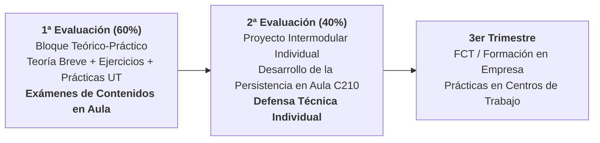

# 🚀 Presentación Inicial: Acceso a Datos — Presencial (DAM 2º)
## Guía Docente, Dinámica de Aula, Planificación en 2 Evaluaciones y Calificación

---

## 🧭 Slide 1: Portada Institucional

- **Centro Educativo**: CIFP Avilés (Centro Integrado de Formación Profesional)
- **Familia Profesional**: Informática y Comunicaciones
- **Ciclo Formativo**: Grado Superior en Desarrollo de Aplicaciones Multiplataforma (DAM) — 2º Curso
- **Módulo Profesional**: **Acceso a Datos (AD)** · Código: **0486** (9 ECTS)
- **Modalidad**: **Presencial** (5 horas semanales: Lunes 3h y Miércoles 2h)
- **Espacio**: **Aula C210** (Turno de Tarde)
- **Profesor**: Sergio Capdevila Díez (Jefe de Departamento de Informática)
- **Curso Académico**: 2026 - 2027

> *"Cualquier aplicación real vive o muere según su persistencia: aprenderemos a conectar, gestionar y optimizar datos con tecnologías profesionales de mercado."*

---

## 💡 Slide 2: ¿De qué trata el módulo de Acceso a Datos?

### 🎯 Propósito Central del Módulo
Aprender a almacenar, recuperar, procesar y sincronizar información de forma eficiente, desacoplada y transaccional entre aplicaciones Java y diferentes sistemas de almacenamiento (desde el sistema de ficheros local hasta bases de datos empresariales relacionales y distribuidas NoSQL).

### 🧩 El Salto desde 1º de DAM
- **En 1º**: Programabas con datos volátiles en memoria RAM (estructuras, variables, objetos en ejecución). Al cerrar la app, los datos se perdían.
- **En Acceso a Datos**: Construimos arquitecturas de persistencia industrial que sobreviven al ciclo de vida del proceso y garantizan la concurrencia e integridad de la información corporativa.

---

## 📅 Slide 3: Estructura del Curso: 2 Evaluaciones Lectivas

Al ser un segundo curso de Formación Profesional, el calendario presencial se concentra exclusivamente en **dos evaluaciones**, ya que durante el **tercer trimestre** (a partir de marzo) el alumnado se incorpora a las empresas para cursar la **FCT (Formación en Centros de Trabajo) / DUAL**:

- **1ª Evaluación (Septiembre - Diciembre)**: Bloque Teórico-Práctico intensivo (**60% de la nota final**).
- **2ª Evaluación (Enero - Marzo)**: Proyecto Intermodular Individual (**40% de la nota final**).
- **3er Trimestre (Marzo - Junio)**: FCT / DUAL en empresa (sin docencia presencial en centro).

---

## 🗺️ Slide 4: Mapa de Contenidos por UT: Nucleares vs. Superficiales

En la 1ª evaluación se imparten todos los contenidos, con foco diferenciado:

| UT | Título y Tecnologías Clave | Tratamiento | Competencias | Horas |
| :---: | :--- | :---: | :--- | :---: |
| **UT1** | **Manejo de Ficheros** (Java NIO.2, Binarios, XML) | **Nuclear / Intensivo** | Streams I/O, `Files`/`Path`, Serialización y XML | 22 h (RA1) |
| **UT2** | **Conectores JDBC & Oracle Database** | **Nuclear / Intensivo** | Driver Thin, HikariCP, transacciones ACID y DAO/DTO | 24 h (RA2) |
| **UT3** | **Mapeo Objeto-Relacional (ORM)** | **Nuclear / Intensivo** | Spring Boot 3, Spring Data JPA, Hibernate y JPQL | 26 h (RA3) |
| **UT5** | **Bases de Datos NoSQL (MongoDB)** | **Nuclear / Intensivo** | Esquemas BSON, consultas, agregaciones y Spring Data | 16 h (RA5) |
| **UT4** | **BBDD Objeto-Relacionales / XML** | *Superficial / Básico* | Conceptos básicos de persistencia OO (db4o) | 4 h (RA4) |
| **UT6** | **Componentes de Acceso a Datos** | *Superficial / Básico* | Conceptos básicos de reutilización y empaquetado JAR | 4 h (RA6) |

---

## ⚙️ Slide 5: Dinámica de Clase Presencial ("Aprender Haciendo")

### 🔄 Rutina en las 5 Horas Semanales (Lunes 3h, Miércoles 2h)
1. **Teoría Breve y Aplicada (15 - 20 minutos máximo)**:
   - Exposición conceptual directa del problema o conector técnico.
   - Demostración de código en vivo (*live coding*) proyectado en pantalla.
2. **Ejercicios Prácticos Inmediatos de Aula**:
   - Programación guiada en los ordenadores del aula C210 con retroalimentación instantánea del profesor.
   - Corrección en directo de fallos típicos (fugas de conexiones, inyecciones SQL, mapeo JPA).
3. **Práctica Integradora por UT (Formativa / No Evaluable Numéricamente)**:
   - Al finalizar cada unidad se desarrolla una práctica de consolidación.
   - **No penaliza con nota numérica**: su fin es afianzar conceptos, autoevaluar tu nivel y preparar los exámenes.

---

## 📝 Slide 6: 1ª Evaluación (60%): Exámenes Prácticos (Teoría Aplicada)

- **Ponderación**: Representa el **60% de la calificación final** del módulo.
- **Instrumentos de Calificación**:
  - Se realizarán **uno o varios exámenes prácticos en ordenador** en el aula C210.
  - **Eminentemente Prácticos**: No existen pruebas memorísticas independientes ni exámenes teóricos puros.
  - **Teoría Aplicada**: Resulta imprescindible conocer y dominar los fundamentos teóricos (drivers JDBC, pools HikariCP, transacciones ACID, ciclo de vida JPA y esquemas NoSQL), pero **se evalúan a través de su aplicación práctica directa** resolviendo problemas reales y programando código Java funcional.
  - **Prácticas por UT**: Actividades formativas para afianzar conceptos y autoevaluar tu nivel real antes del examen.
- **Requisito Indispensable**: Obtener una nota **igual o superior a 5.0** en este bloque.

---

## 🚀 Slide 7: 2ª Evaluación (40%): Proyecto Intermodular Individual

- **Ponderación**: Representa el **40% de la calificación final** del módulo.
- **Régimen**: Estrictamente **individual** (proyecto transversal de software de ciclo DAM).
- **Rol en las Horas de AD (5h/semana en Aula C210)**:
  - El alumno diseña, programa, depura y optimiza **toda la capa de persistencia y datos del proyecto**.
  - Pone en práctica de forma integrada todo lo aprendido en la 1ª evaluación (ficheros, JDBC relacional, JPA/Hibernate y MongoDB).
- **Criterios de Calificación**:
  - Arquitectura y calidad técnica de datos (50%).
  - Funcionalidad CRUD, transacciones y persistencia políglota (30%).
  - Repositorio Git, memoria técnica y **defensa presencial individual** en aula (20%).
- **Requisito Indispensable**: Obtener una nota **igual o superior a 5.0**.

---

## ⚖️ Slide 8: Condiciones de Aprobado y Recuperaciones

$$\text{Nota Final} = 0.60 \cdot \text{Nota 1ª Evaluación} + 0.40 \cdot \text{Nota 2ª Evaluación}$$

> [!IMPORTANT]
> ### 🎯 Condición Obligatoria e Innegociable: Ambas Partes ≥ 5.0
> Para poder hacer la media ponderada y aprobar el módulo, es **estrictamente obligatorio obtener una calificación igual o superior a 5.0 en AMBAS evaluaciones de forma independiente**:
> $$\text{Nota 1ª Evaluación} \ge 5.0 \quad \text{y} \quad \text{Nota 2ª Evaluación} \ge 5.0$$
> Si alguna parte no alcanza el 5.0, el módulo quedará suspenso y deberá recuperarse la parte suspensa.

### 🔁 Recuperaciones Presenciales
- **1ª Evaluación**: Examen global teórico-práctico de recuperación en aula C210.
- **2ª Evaluación**: Subsanación de no conformidades en el repositorio Git y re-defensa individual en aula.

---

## 🛠️ Slide 9: Ecosistema Tecnológico de Trabajo

- 💻 **IDE Principal en el Aula**: **Eclipse IDE** (entorno de referencia del aula C210 para explicaciones y prácticas). *Se permite optativamente utilizar otro IDE (IntelliJ IDEA, VS Code) siempre que se asegure la compatibilidad con Maven.*
- ☕ **Java SE 21 LTS**: Sintaxis moderna, Records, Pattern Matching y Java NIO.2.
- 🗄️ **Oracle Database XE**: Motor relacional empresarial de referencia.
- 🍃 **MongoDB Community**: Base de datos NoSQL líder documental.
- 🌱 **Spring Boot 3 & JPA**: Framework backend estándar en la industria.
- 📦 **Apache Maven**: Gestión automatizada de dependencias y empaquetado.
- 🐙 **Git & GitHub**: Control de versiones y auditoría de proyectos.

---

## 🤝 Slide 10: Política de Uso de Inteligencia Artificial (IA)

1. **Durante la 1ª Evaluación (Contenidos Base y Pruebas)**:
   - 📖 **Herramienta de Estudio**: Se permite exclusivamente para consultas teóricas, aclaración de dudas y comprensión conceptual.
   - ⚠️ **Ejercicios y Prácticas Formativas**: **No se recomienda usarla**. Resolver los ejercicios por uno mismo es indispensable para asimilar la sintaxis y fijar la lógica de programación.
   - 🚫 **Exámenes de Aula**: **Totalmente prohibida**. Las pruebas presenciales evalúan tu dominio técnico real y autonomía individual.
2. **Durante la 2ª Evaluación (Proyecto Intermodular)**:
   - 🤖 **Uso Permitido**: Se permite el uso de IA como acelerador y copiloto de desarrollo.
   - 🎤 **Explicación y Defensa Obligatoria**: El docente podrá pedir explicaciones técnicas detalladas de cualquier parte del código para demostrar fehacientemente que se sabe lo que se está haciendo. No se aceptará código que no se sepa justificar.

---

## 🕒 Slide 11: Horario Presencial y Ubicación

- 🏫 **Aula Asignada**: **Aula C210** (Planta 2, Edificio Central)
- ⏰ **Horario Semanal (5 Horas Presenciales)**:
  - **Lunes**: 3 horas de docencia de tarde (17:35 - 20:50, con recreo de tarde).
  - **Miércoles**: 2 horas de docencia de tarde (17:35 - 19:55, con recreo de tarde).
- 📧 **Contacto y Dudas**: Correo corporativo Educastur y consultas directas en aula.

---

## 🏁 Slide 12: ¡Comenzamos! Próximos Pasos

- Comprobación de la instalación de JDK 21 y Maven en los puestos del aula C210.
- Clonado del repositorio inicial de clase.
- Arranque de la **UT1: Manejo de Ficheros (Texto, NIO.2 y Binarios)**.

**¿Dudas o preguntas iniciales?** 🙋‍♂️
