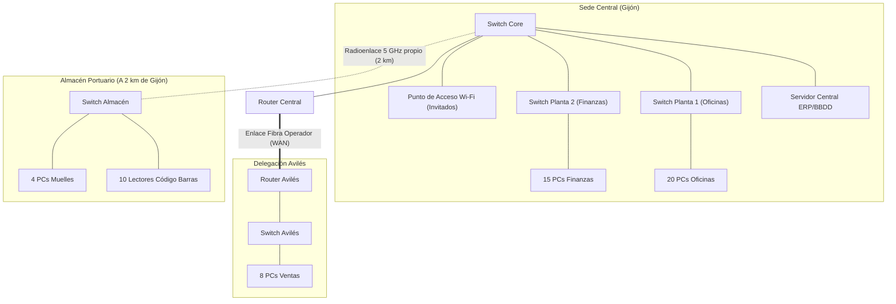

# 💻 Ejercicio 2: Análisis de Topologías Físicas y Clasificación de Redes de una Empresa

> **Módulo**: [[MOC-Redes-Locales|Redes Locales (SMR)]] | **Unidad**: [[UD01-Introduccion-Redes-Locales-Caracterizacion|UT1]] | **RA**: `RA1 (CE1.a)` | **Tiempo estimado**: `60 min`

---

## 🎯 Objetivos de la Actividad
1. Clasificar redes informáticas según su alcance territorial o cobertura geográfica (**PAN**, **LAN**, **CAN**, **MAN**, **WAN**).
2. Distinguir con precisión entre la **topología física** (cableado real) y la **topología lógica** (forma en que viajan los datos).
3. Evaluar las ventajas, desventajas y puntos únicos de fallo (**SPOF - Single Point of Failure**) de las topologías en bus, anillo, estrella, árbol y malla.
4. Identificar el modelo de relación funcional (**Cliente/Servidor** vs **Peer-to-Peer / P2P**) adecuado a cada necesidad operativa.

---

## 📋 Caso Práctico: Empresa "Logística Cantábrica S.L."

"Logística Cantábrica S.L." es una empresa de distribución con sede central en Gijón y delegaciones operativas en Avilés y Oviedo. Como técnico de redes recién contratado, te encomiendan auditar y diseñar la infraestructura de comunicaciones:

---

## 📝 Tareas a Desarrollar

### Bloque 1: Clasificación Territorial de Redes (25 puntos)

Completa la siguiente tabla clasificando cada uno de los entornos de comunicación descritos en la empresa:

| Entorno de Red | Clasificación (PAN/LAN/CAN/MAN/WAN) | Justificación Técnica (Alcance, Propiedad del Medio) |
| :--- | :--- | :--- |
| **Planta 1 y Planta 2 de la Sede Central** | | |
| **Conexión entre el Switch Central y el Almacén Portuario a 2 km** (mediante antena de radioenlace propia sin operador) | | |
| **Interconexión entre la Sede Central (Gijón) y la Delegación de Avilés** (mediante línea alquilada a Telefónica/Vodafone) | | |
| **Comunicación Bluetooth entre el smartphone de un directivo y sus auriculares/reloj** | | |
| **Red que interconecta todas las sedes logísticas de la empresa en España y Portugal** | | |

---

### Bloque 2: Análisis de Topologías y Tolerancia a Fallos (40 puntos)

1. **Topología Física vs Lógica:**
   - ¿Qué topología física presenta la red interna de la Sede Central (observa cómo se conectan los switches y equipos finales)?
   - En una red Ethernet moderna cableada con cable de par trenzado UTP conectado a conmutadores (switches), ¿cuál es la topología física y cuál es la topología lógica? Justifica tu respuesta indicando cómo fluyen las tramas.
2. **Análisis de Puntos Críticos de Fallo:**
   Analiza qué ocurriría en cada una de las siguientes situaciones:
   - **Caso A**: Se corta el cable UTP que une el PC del puesto 5 con el Switch de Planta 1. ¿A quién afecta el corte?
   - **Caso B**: Se quema la fuente de alimentación del **Switch Core (SW_G1)**. ¿Qué servicios o puestos quedan incomunicados?
   - **Caso C**: Si la empresa mantuviera una antigua red en **Bus coaxial (10Base2)** y un cable se desconecta de su conector BNC en T, ¿qué le ocurriría al resto de los equipos del segmento? Explica el concepto de *terminador de bus*.
3. **Alternativa de Alta Disponibilidad:**
   - En la Sede Central, los directores exigen que si un enlace de fibra interna entre plantas se rompe, la red continúe funcionando sin interrupciones. ¿Qué topología física proporcionaría esta redundancia?
   - ¿Cómo se denomina la topología donde **todos** los nodos están conectados con **todos** los demás? Si tuviéramos 5 conmutadores en esta topología completa, ¿cuántos enlaces de cable necesitaríamos en total? (Aplica la fórmula $N(N-1)/2$).

---

### Bloque 3: Modelo de Relación Funcional (20 puntos)

1. En la empresa, todos los trabajadores consultan el software de facturación y base de datos alojado en el `Servidor Central ERP`. ¿A qué modelo de relación funcional corresponde este esquema? Explica dos ventajas y dos desventajas de este modelo.
2. Para agilizar la compartición de archivos pesados de diseño entre tres delineantes del departamento de marketing, estos deciden crear una carpeta compartida en Windows en sus propios puestos de trabajo sin recurrir al servidor central ni pedir permisos al administrador.
   - ¿Qué modelo de red representa esta práctica?
   - ¿Qué problemas de seguridad, copias de respaldo y control de acceso conlleva en un entorno empresarial?

---

### Bloque 4: Organismos de Normalización y Estándares (15 puntos)

Relaciona cada necesidad tecnológica de la empresa con el organismo de normalización responsable de su especificación:

1. **IEEE 802.3**: Estándar que define las redes de área local por cable...
2. **IEEE 802.11**: Estándar que define las comunicaciones inalámbricas...
3. **IETF**: Organismo responsable de publicar las RFCs que definen protocolos de Internet como IP, TCP, UDP y DNS...
4. **ISO**: Organización que definió el modelo conceptual de 7 capas OSI...
5. **TIA/EIA-568**: Norma que especifica el código de colores para crimpar cables de red RJ-45 (T568A / T568B)...

*Pregunta*: ¿Por qué es vital para una empresa que todos sus equipos cumplan con estos estándares internacionales en lugar de utilizar tecnologías propietarias cerradas?

---

## 🔑 Solución Modelo (Profesor Sergio)

> [!NOTE]- Ver Solución Detallada (Haz clic para desplegar)
> ### Solución Bloque 1: Clasificación Territorial
> | Entorno | Clasificación | Justificación Técnica |
> | :--- | :--- | :--- |
> | **Plantas 1 y 2 Sede Central** | **LAN** (Local Area Network) | Alcance restringido a un edificio/planta (< 100 m por tramo), alta velocidad (1 Gbps), medio e infraestructura de propiedad privada de la empresa. |
> | **Radioenlace Sede - Almacén (2 km propio)** | **CAN** (Campus Area Network) / **MAN privada** | Conecta dos edificios de la misma organización dentro de un entorno municipal próximo mediante un enlace inalámbrico privado sin depender de un operador público de telecomunicaciones. |
> | **Gijón - Avilés (vía Operador)** | **WAN** (Wide Area Network) / **MAN** | Interconecta sedes separadas geográficamente (aprox. 25 km) utilizando infraestructura pública y líneas de transmisión alquiladas a un proveedor de servicios (ISP / Telco). |
> | **Bluetooth Directivo (Smartphone - Reloj)** | **PAN** (Personal Area Network) | Cobertura personal muy reducida (< 10 metros), baja potencia, interconexión de dispositivos individuales del usuario (IEEE 802.15). |
> | **Sedes en España y Portugal** | **WAN** (Wide Area Network) | Cobertura nacional e internacional transfronteriza que atraviesa múltiples redes de operadores públicos y países. |
> 
> ---
> 
> ### Solución Bloque 2: Topologías y Tolerancia a Fallos
> 1. **Topología de la Sede Central:**
>    - **Topología física**: **Árbol** o **Estrella Jerárquica / Extendida** (los equipos conectan en estrella a switches de planta, y estos a su vez convergen en estrella hacia el Switch Core).
>    - **Física vs Lógica en Ethernet con switches:**
>      - *Topología física*: **Estrella** (cada cable sale de un puesto hacia una boca del switch).
>      - *Topología lógica*: **Punto a punto conmutada** (el conmutador aísla las conversaciones leyendo la MAC de destino y reenvía la trama únicamente por el puerto del receptor, sin inundar el medio como hacía el hub en bus).
> 
> 2. **Puntos Críticos de Fallo:**
>    - **Caso A**: Solo queda desconectado el PC del puesto 5. El resto de la red sigue operando con total normalidad (aislamiento de fallos de la topología en estrella).
>    - **Caso B**: La caída del Switch Core provoca una caída general catastrófica. La Planta 1, Planta 2, el Almacén, el Router WAN y el Servidor Central quedan incomunicados entre sí. El Switch Core es un **Punto Único de Fallo (SPOF)**.
>    - **Caso C**: En un bus 10Base2, la rotura o desconexión en cualquier punto rompe el circuito. La señal eléctrica no encuentra la impedancia del terminador (50 $\Omega$), se refleja produciendo ondas estacionarias y colisiones masivas, **dejando inoperativa la totalidad del segmento de red**.
> 
> 3. **Redundancia:**
>    - Topología recomendada: **Malla parcial o enlaces redundantes agregados (LACP / EtherChannel)** con protocolo Spanning Tree (STP) para evitar bucles.
>    - **Malla Completa (Full Mesh)**: Todos con todos.
>      - Con $N = 5$: Enlaces necesarios = $\frac{5 \times (5 - 1)}{2} = \frac{20}{2} = \mathbf{10\text{ enlaces}}$.
> 
> ---
> 
> ### Solución Bloque 3: Relación Funcional
> 1. **Modelo Cliente/Servidor:**
>    - *Ventajas*: Centralización de la seguridad y copias de seguridad (backup); gestión centralizada de permisos y usuarios; alto rendimiento en el servidor dedicado.
>    - *Desventajas*: Alto coste de hardware y licencias; el servidor representa un punto único de fallo si no está clusterizado; requiere administración técnica especializada.
> 2. **Modelo P2P (Carpetas compartidas sin control central):**
>    - *Problemas*:
>      - Dispersión de la información: no se sabe cuál es la versión más reciente del archivo.
>      - Fallos de seguridad: credenciales débiles o accesos abiertos a toda la LAN.
>      - Pérdida de copias de seguridad: los datos en puestos cliente no se respaldan en los backups nocturnos del servidor.
>      - Si el PC del compañero se apaga o reinicia, el resto pierde el acceso al archivo.
> 
> ---
> 
> ### Solución Bloque 4: Normalización
> - **Importancia de los estándares**: Garantizan la **interoperabilidad** entre equipos de distintos fabricantes (Cisco, HP, D-Link, Dell, etc.), evitan el bloqueo o dependencia de un único proveedor (*vendor lock-in*), reducen los costes de compra y aseguran que los conocimientos de los técnicos sean universales y transferibles.